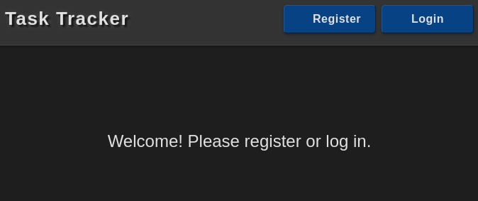
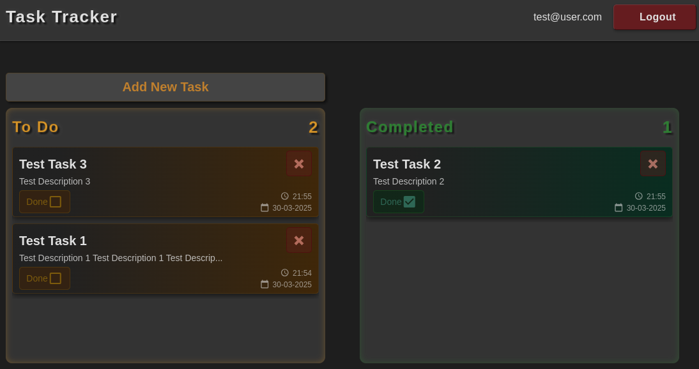
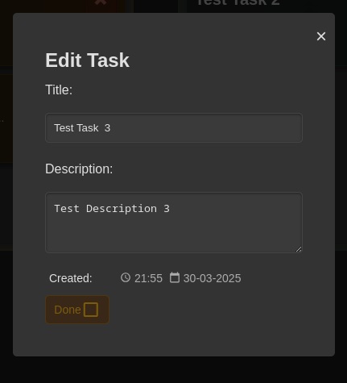
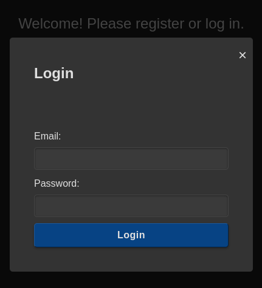
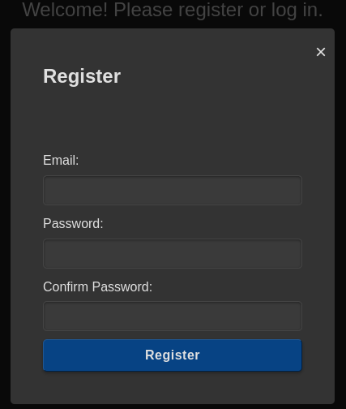
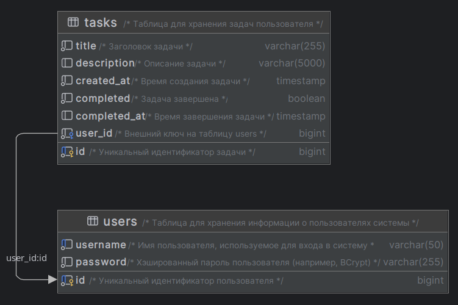

Проект “Планировщик задач”
===============================================================================================

Многопользовательский планировщик задач, реализованный как многомодульное приложение. Пользователи могут использовать его как TODO-лист: регистрироваться, авторизовываться, создавать, редактировать и удалять задачи. При регистрации отправляется приветственное email-сообщение, а ежедневные отчёты о прогрессе задач приходят пользователям по email с помощью микросервисов и Kafka. Источником вдохновения для проекта является Trello.

(Пет-проект, написанный для освоения и закрепления навыков в Java, Spring Boot и других технологиях)

Оглавление
----------

1. [Использованные инструменты / технологии](#использованные-инструменты--технологии)
2. [Архитектура и модули](#архитектура-и-модули)
3. [Интерфейс приложения](#интерфейс-приложения)
4. [Базы данных](#базы-данных)
5. [Требования приложения](#требования-приложения)
6. [Инструкция по запуску приложения](#инструкция-по-запуску-приложения)
7. [CI/CD](#cicd)
8. [Техническое задание](#техническое-задание)

## Использованные инструменты / технологии:

### Backend

 &nbsp;
 &nbsp;
 &nbsp;
 &nbsp;
 &nbsp;
 &nbsp;
 &nbsp;
 &nbsp;
 &nbsp;
 &nbsp;


### Frontend

 &nbsp;
 &nbsp;
 &nbsp;
 &nbsp;


### Инфраструктура

 &nbsp;
 &nbsp;


## Архитектура и модули

Проект построен на микросервисной архитектуре и состоит из четырёх основных модулей, взаимодействующих через REST API и брокер сообщений Kafka. Каждый модуль выполняет свою задачу, а Kafka используется для асинхронной отправки email-уведомлений.

### task-tracker-backend
- **Функционал**: Основной REST API сервис для работы с пользователями и задачами.
    - Регистрация (`POST /user`) с автоматической отправкой приветственного email через Kafka.
    - Получение информации о текущем пользователе (`GET /user`)
    - Аутентификация (`POST /auth/login`) с использованием JWT-токенов.
    - Управление задачами: 
      - создание (`POST /tasks`), 
      - получение списка (`GET /tasks`), 
      - редактирование (`PUT /tasks/{taskId}`), 
      - удаление (`DELETE /tasks/{taskId}`), 
      - получение по ID (`GET /tasks/{taskId}`).
- **Технологии**: Spring Boot, Spring Security, Spring Data JPA, Liquibase.
- **Зависимости**: Postgres для хранения данных, Kafka для отправки задач на email.

### task-tracker-frontend
- **Функционал**: Одностраничное веб-приложение, раздаваемое через Nginx.
    - Отображает интерфейс для авторизации, регистрации и управления задачами.
    - Взаимодействует с `task-tracker-backend` через Ajax-запросы с префиксом `api/`, добавляемым Nginx при проксировании.
- **Технологии**: HTML, CSS, JavaScript, jQuery, Nginx.

### task-tracker-email-sender
- **Функционал**: Сервис для отправки email-уведомлений.
    - Слушает Kafka-топик `EMAIL_SENDING_TASKS`, десериализует сообщения и отправляет email через SMTP (например, SendGrid).
    - Обрабатывает приветственные письма при регистрации и ежедневные отчёты от `task-tracker-scheduler`.
- **Технологии**: Spring Boot, Spring Mail, Spring Kafka.

### task-tracker-scheduler
- **Функционал**: Сервис для формирования и отправки ежедневных отчётов.
    - Каждую полночь (по Cron) анализирует задачи пользователей за сутки.
    - Отправляет сообщения в Kafka-топик `EMAIL_SENDING_TASKS` с отчётами:
        - Количество выполненных задач за день (если есть).
        - Список невыполненных задач (если остались).
- **Технологии**: Spring Boot, Spring Scheduler, Spring Kafka.

### Роль Kafka
Kafka используется как брокер сообщений для асинхронной передачи задач на отправку email между сервисами:
- `task-tracker-backend` отправляет приветственное письмо при регистрации.
- `task-tracker-scheduler` отправляет ежедневные отчёты.
- `task-tracker-email-sender` читает топик `EMAIL_SENDING_TASKS` и выполняет отправку.

## Интерфейс приложения

Приложение одностраничное, всё взаимодействие с сервером осуществляется через JavaScript/Ajax, а интерфейс обновляется с помощью jQuery.

### Главная страница

URL - '/'



- Для неавторизованных пользователей: отображает кнопки входа и регистрации.



- Для авторизованных пользователей: отображает список задач (сделанные и несделанные), кнопку для создания новой задачи и кнопку "Logout".



- Модальное окно редактирования задачи, позволяет изменять заголовок, описание и статус задачи.

### Страница входа



URL - '/auth/login' (обрабатывается через модальное окно на главной странице)

### Страница регистрации



URL - '/user' (обрабатывается через модальное окно на главной странице)

## Базы данных



- **Postgres**: Хранит данные пользователей (`users`) и задач (`tasks`).
    - Таблица `username`: `id`, `password` (хранится в зашифрованном виде для Spring Security).
    - Таблица `tasks`: `id`, `title`, `description`, `created_at`, `completed`, `completed_at`, `user_id`.
- **Liquibase**: Используется для управления миграциями базы данных (создание и обновление схемы). Миграции находятся в модуле `task-tracker-backend`.

## Требования приложения

- Java 21+
- Apache Maven
- Docker и Docker Compose
- SMTP-сервер (например, SendGrid) для отправки email-уведомлений

## Инструкция по запуску приложения

### Клонирование репозитория

1. **Клонирование репозитория с помощью Git**:
    - Откройте терминал или командную строку.
    - Выполните команду:
      ```sh
      git clone https://github.com/VladShi/task-tracker.git
      ```
    - Перейдите в директорию проекта:
      ```sh
      cd task-tracker
      ```

### Настройка проекта

1. **Настройка конфигурационных файлов**:

    - В каждом модуле (`task-tracker-backend`, `task-tracker-scheduler`, `task-tracker-email-sender`) в директории `src/main/resources` есть файл `application.properties.example`.
    - Скопируйте его в `application.properties`:
      ```sh
      cp task-tracker-backend/src/main/resources/application.properties.example task-tracker-backend/src/main/resources/application.properties
      cp task-tracker-scheduler/src/main/resources/application.properties.example task-tracker-scheduler/src/main/resources/application.properties
      cp task-tracker-email-sender/src/main/resources/application.properties.example task-tracker-email-sender/src/main/resources/application.properties
      ```
    - Значения по умолчанию в этих файлах подходят для работы "из коробки", но вы можете изменить их при необходимости.

2. **Настройка переменных окружения**:

   - В корне проекта находится файл `.env.example`.
   - Создайте файл `.env` на его основе:
     ```sh
     cp .env.example .env
     ```
   - Откройте `.env` и проверьте значения. Для работы "из коробки" они уже настроены, но для отправки email-уведомлений заполните SMTP-настройки своим данными:
     ```env
     # SMTP server
     MAIL_HOST=smtp.sendgrid.net
     MAIL_PORT=587
     MAIL_USERNAME=your_username
     MAIL_PASSWORD=your_password
     MAIL_VERIFIED_EMAIL=your_email@example.com
     ```
   - Остальные переменные (например, `POSTGRES_HOST`, `KAFKA_BOOTSTRAP_SERVERS`) можно оставить как есть.

### Запуск приложения

1. **Запуск всех модулей приложения через Docker Compose**:

   - Убедитесь, что Docker и Docker Compose установлены.
   - В корне проекта выполните:
     ```sh
     docker-compose up -d --build
     ```
   - Это соберёт образы для всех модулей (`backend`, `frontend`, `scheduler`, `email-sender`) и запустит контейнеры вместе с зависимостями (`postgres`, `kafka`, `zookeeper`).
   - Приложение будет доступно по адресу http://localhost:80.

2. **Запуск модулей и окружения для разработки**:

    Если нужно запустить только окружение и отдельные модули вручную (например, через IDE):
   - Используйте `docker-compose.yml` вместе с `docker-compose.dev.yml`:
     ```sh
     docker-compose -f docker-compose.yml -f docker-compose.dev.yml up -d
     ```
   - Отключите сборку ненужных модулей с помощью профилей в `docker-compose.dev.yml`. Например, чтобы отключить `task-tracker-backend`:
     ```yaml
     task-tracker-backend:
       profiles:
         - disabled
     ```
   - Запустите модуль вручную, например, через IntelliJ IDEA, указав главный класс модуля: 
     - `BackendApplication`
     - `EmailSenderApplication`
     - `SchedulerApplication`
   - Или для запуска модуля без IDE с помощью Maven и терминала:
     - Перейдите в директорию нужного модуля, например:
       ```sh
       cd task-tracker-backend
       ```
     - Соберите проект и запустите приложение:
       ```sh
       mvn clean package
       java -jar target/task-tracker-backend-1.0-SNAPSHOT.jar
       ```
       имя JAR-файла может отличаться, это зависит от настроек сборки и версии указанных в `pom.xml`.

## CI/CD
- Проект использует GitHub Actions для автоматизации сборки и деплоя.
- Workflow-файлы находятся в `.github/workflows/`:
  - `ci.yml`: Сборка Docker-образов для всех модулей (`backend`, `frontend`, `scheduler`, `email-sender`) и их публикация на Docker Hub.
  - `cd.yml`: Деплой приложения на удалённый сервер с использованием `docker-compose.prod.yml`, который загружает образы с Docker Hub и запускает их.
- Для деплоя требуется настроить секреты в GitHub (например, `SSH_PRIVATE_KEY`, `DOCKERHUB_USERNAME`, `MAIL_PASSWORD`).

Техническое задание
==
(данный проект делался на основе этого ТЗ)

Многопользовательский планировщик задач. Пользователи могут использовать его в качестве TODO листа. Источником вдохновения для проекта является Trello.

*   [Что нужно знать](#что-нужно-знать)
*   [Мотивация проекта](#мотивация-проекта)
*   [Функционал приложения](#функционал-приложения)
*   [Интерфейс приложения](#интерфейс-приложения-1)
*   [SQL база данных](#sql-база-данных)
    *   [Миграции](#миграции)
*   [JWT](#jwt)
*   [Сервисы](#сервисы)
    *    [Бэкенд](#бэкенд)
    *    [Фронтенд](#фронтенд)
    *    [Рассыльщик писем](#рассыльщик-писем)
    *    [Планировщик](#планировщик)
*   [Работа с Kafka](#работа-с-kafka)
*   [Mailjet](#mailjet)
*   [Docker](#docker)
*   [Структура проекта](#структура-проекта)
*   [Деплой](#деплой)
*   [CI/CD](#cicd-1)
*   [План работы над приложением](#план-работы-над-приложением)

Что нужно знать
---------------

*   [Java](https://htmltomd.com/java-backend-learning-course/technologies/java/) - коллекции, ООП
*   [Maven/Gradle](https://htmltomd.com/java-backend-learning-course/technologies/build-systems/)
*   [Backend](https://htmltomd.com/java-backend-learning-course/technologies/backend/)
    *   Spring Boot, Spring Security, Spring Session, Spring Kafka, Spring Scheduler, Spring Mail
    *   JWT
*   [Базы данных](https://htmltomd.com/java-backend-learning-course/technologies/databases/)
    *   SQL
    *   Spring Data JPA
    *   Миграции
*   [Frontend](https://htmltomd.com/java-backend-learning-course/technologies/frontend/) - HTML/CSS, Bootstrap, Javascript, Ajax
*   [Docker и микросервисы](https://htmltomd.com/java-backend-learning-course/technologies/microservices/)
    *   Контейнеры, образы, volumes, написание Dockerfile, Docker Compose
    *   Брокер сообщений Kafka
*   [Деплой](https://htmltomd.com/java-backend-learning-course/technologies/dev-ops/#%d0%b4%d0%b5%d0%bf%d0%bb%d0%be%d0%b9)
    *   Деплой
    *   CI/CD, GitHub Actions

Мотивация проекта
-----------------

*   Знакомство с микросервисами на практике - разработка проекта, разделённого на несколько сервисов
*   Использование новых модулей Spring Boot - Spring Kafka, Scheduler, Mail
*   Практика с Docker и Docker Compose, докеризация Spring Boot приложение (упаковка его в Docker образ)
*   Знакомство и практика с брокером сообщений Kafka
*   Самостоятельная разработка части схемы REST API

Дисклеймер. Планировщик задач - довольно простой и легковесный проект для микросервисного подхода. Но проект достаточной сложности вышел бы за рамки учебного по объёму и сложности.

Функционал приложения
---------------------

Работа с пользователями:

*   Регистрация
*   Авторизация
*   Logout

Работа с задачами:

*   Создание, редактирование (каждая задача имеет заголовок и описание)
*   Пометка задачи как сделанной
*   Удаление

Оповещение пользователей по email:

*   Приветственное письмо
*   Каждый день в полночь оповещение о том, сколько задач было сделано за прошедшие сутки, и какое количество осталось невыполненными

Интерфейс приложения
--------------------

Веб-приложение является одностраничным, всё общение с сервером происходит с помощью JavaScript/Ajax, интерфейс обновляется через jQuery.

*   Заголовок
    *   Для неавторизованных пользователей - кнопки регистрации и авторизации
    *   По нажатию на кнопки открывается модальный диалог с формой регистрации или авторизации
        *   Поля диалога регистрации - email, password, repeat password
        *   Поля диалога авторизации - email, password
        *   В случае ошибки регистрации или авторизации, приложение должно отобразить ошибку, подобно Thymeleaf
    *   Для авторизованных пользователей - логин текущего пользователя и кнопка Logout
*   Контент (только для авторизованных пользователей)
    *   Поле ввода заголовка новой задачи с кнопкой “Добавить”
    *   Список несделанных задач
    *   Список сделанных задач

При клике на задачу открывается модальное окно со следующими элементами:

*   Поле ввода заголовка задачи
*   Многострочное поле ввода описания задачи
*   Чекбокс, чтобы пометить задачу сделанной (и обратно - пометить несделанной)
*   Кнопка “удалить”

У формы модального окна нет кнопки “сохранить”. JavaScript должен сохранять состояние задачи с помощью Ajax запросов, каждый раз когда пользователь нажимает на чекбокс, или редактирует поля ввода.

SQL база данных
---------------

В этом проекте студент самостоятельно разрабатывает структуру базы данных для хранения пользователей и задач. Отношение между пользователем и задачами - один ко многим.

Как и в предыдущем проекте, в таблице `Users` ориентироваться стоит на интеграцию с Spring Security. Эта библиотека экосистемы Spring подразумевает определённые атрибуты, которыми должен обладать пользователь, и список которых и станет основой колонок для таблицы.

Таблица `Tasks` должна содержать поля для описания заметки - заголовок, текст, владелец, статус, и время (timestamp), когда задача была помечена как сделанная.

### Миграции

Рекомендую воспользоваться инструментом миграций для создания таблиц. Необходимо будет принять решение, какой из сервисов является “главным” по работе со схемой БД, и содержит в себе миграции.

JWT
---

Вместо сессий воспользуемся JWT. Можно обойтись без refresh token’ов, выдавать только access token, по которым авторизовывать запросы к REST API.

Стоит реализовать авторизацию JWT на уровне Spring Security, например, в виде фильтра, который будет доставать access token из запроса, декодировать и валидировать его.

Сервисы
-------

### Бэкенд

Spring Boot приложение, реализующее REST API для работы с пользователями, авторизацией, и задачами.

#### POST `/user` - регистрация пользователя

*   Тело запроса - поля формы в формате `application/x-www-form-urlencoded` или `application/json`
*   Зарегистрированный пользователь сразу же автоматически авторизуется, без отдельного заполнения логин формы
*   В случае успешной регистрации, код ответа HTTP 200, HTTP заголовок ответа содержит выданный пользователю JWT access token
*   В случае неуспешной регистрации, код и тело ответа описывают ошибку

Пример ответа с ошибкой - “this email is already taken” - HTTP code 409:
```json
   {
      "message": "This email is already taken"
   }
```

Структура ответа с ошибкой - JSON объект с полем message. Код ответа должен быть наиболее подходящим к ситуации из 4хх 5хх кодов ошибок - [https://datatracker.ietf.org/doc/html/draft-ietf-httpbis-p2-semantics-18#section-7.4](https://datatracker.ietf.org/doc/html/draft-ietf-httpbis-p2-semantics-18#section-7.4).

Так же, в случае успешной регистрации, пользователю отправляется приветственное письмо (непосредственная отправка письма происходит в другом сервисе, детали ниже в разделе **Kafka**).

#### GET `/user` - получение текущего пользователя

*   Успешный ответ с кодом HTTP 200 содержит модель пользователя в виде JSON объекта
*   В случае, если пользователь неавторизован, его токен истек - тело ответа содержит сообщение об ошибке, код ответа - HTTP 401

Пример ответа с кодом HTTP 200:
```json
    {
        "id": 1,
        "email": "my@email.com"
    }
```

#### POST `/auth/login` - авторизация пользователя

*   Тело запроса - поля формы в формате `application/x-www-form-urlencoded` или `application/json`
*   В случае успешной авторизации, код ответа HTTP 200, HTTP заголовок ответа содержит выданный пользователю JWT access token
*   В случае неуспешной авторизации, код и тело ответа описывают ошибку

#### GET `/tasks` - получение списка заметок текущего пользователя

*   Успешный ответ с кодом HTTP 200 содержит список моделей задач в виде JSON массива
*   В случае, если пользователь неавторизован, его токен истек - тело ответа содержит сообщение об ошибке, код ответа - HTTP 401

* * *

Дизайн методов для создания, редактирования, удаления задач студенту предлагается разработать самостоятельно.

### Фронтенд

Набор статических файлов:

*   HTML разметка структуры главной страницы (динамические данные вставляются через JavaScript/jQuery)
*   CSS
*   JavaScript

При разработке, файлы можно раздавать локальным сервером встроенным в Intellij IDEA. В контексте Docker Compose стека, образ фронтенд сервиса будет содержать веб-сервер Nginx, раздающий статику.

*   При загрузке страницы, JavaScript делает запрос на получение текущего пользователя. Ответ 401 HTTP означает, что пользователь неавторизован, 200 - авторизован. Для авторизованного пользователя мы можем запросить и отобразить список задач Работа с JavaScript/Ajax:
*   Формы авторизации и регистрации должны быть сверстаны с помощью тега `form`, но вместо обработчика по-умолчанию (POST запрос и перезагрузка страницы), jQuery будет переопределять обработчик, исполнять POST запрос через Ajax и реагировать на результат, в соответствии с кодом ошибки
*   Веб-страница и REST API будут доступны на разных портах - 80 и 8080. Для вызова методов REST API через Ajax может потребоваться выдача разрешения браузеру через CORS - [https://developer.mozilla.org/en-US/docs/Web/HTTP/CORS](https://developer.mozilla.org/en-US/docs/Web/HTTP/CORS)

### Рассыльщик писем

Spring Boot приложение с двумя модулями - Spring Mail и Spring AMQP.

С помощью Spring AMQP приложение подключается к Kafka и создает топик `EMAIL_SENDING_TASKS`, после чего подписывается на сообщения, поступающие от планировщика и бэкенд-сервиса.

Для каждого полученного сообщения, содержимое которого десериализуется в экземпляр модели, пользуемся модулем Spring Mail, чтобы отправить письмо. Подробнее о том, откуда брать SMTP конфигурацию, написано ниже в разделе **Mailjet**.

### Планировщик

Spring Boot приложение с двумя модулями - Spring Scheduler и Spring AMQP.

Задача сервиса - раз в сутки итерировать всех пользователей, и формировать для них отчёты о задачах и изменениях в них за сутки.

*   Пользователям, у которых на конец дня есть невыполненные задача, отправляется емейл вида “У вас осталось N несделанных задач”. Тело письма содержит заголовки этих задач (не более какого-то разумного количества, например 5)
*   Пользователям, у которых за последние сутки 1 или более задач были отмечены как сделанные, отправляется емейл вида “За сегодня вы выполнили N задач”. Тело письма содержит заголовки выполненных задач
*   Пользователям, для которых верны оба условия выше, отправляется емейл и со списком несделанных, и сделанных за последние сутки задач

Spring Scheduler по Cron выражению каждую полночь вызывает метод, читающий список пользователей, анализирующий их заметки, и формирующий емейлы для отправки. Сформированные емейлы упаковываются в классы-модели и отправляются в Kafka топик.

Работа с Kafka
--------------

Kafka в контексте Docker Compose стека запускается образов, подобно базе данных.

*   Задачи для отправки емейлов будут попадать в топик `EMAIL_SENDING_TASKS`
*   Бэкенд сервис и планировщик записывают сообщения в топик, рассыльщик писем - читает
*   Формат сообщений - JSON, сереализуемый и десериализуемый по модели, описанной с помощью класса Java, подобно моделям для контроллеров REST API. Сообщения в топике `EMAIL_SENDING_TASKS` должны содержать следующие поля - адрес получателя, заголовок и текст письма
*   Для интеграции Spring c Kafka можно использовать модуль Spring Kafka

Mailjet
-------

Для отправки SMTP нужны логин, пароль, хост и порт SMTP сервера. У емейл сервисов, например Gmail, mail.ru, есть SMTP сервера, с которыми работают емейл-клиенты. Теоретически, можно воспользоваться их сервером, и отправлять письма, авторизовываясь логином и паролем своего ящика, но в реальности, для писем и рассылок обычно пользуются специальными для этого созданными сервисами, например Mailjet, Mailchimp, Mailgun (и десятками аналогичных).

Для примера рассмотрим [Mailjet](https://www.mailjet.com/). Бесплатный лимит сервиса - 200 писем на отправку в сутки. Необходимо зарегистрироваться там, сконфигурировать sender адрес (адрес отправителя писем), получить credentials (логин и пароль) и остальные SMTP настройки.

Логин и пароль - секретные данные, которые не должны попасть в git репозиторий. При запуске приложения из IDE или Docker Compose стека, секреты можно подключить к приложению через переменные окружения.

Docker
------

В данном проекте воспользуемся Docker для запуска необходимых приложений, и упаковки наших четырех сервисов в Docker образы.

Необходимо:

*   Найти образы для каждого нужного приложения
*   Написать Docker Compose файл для запуска стека с приложениями (по сервису для каждого)
*   Упаковать сервисы в Docker образы, написав для них Dockerfile

Сервисы:

*   task-tracker-backend (порт 8080)
*   task-tracker-frontend (порт 80)
*   task-tracker-scheduler
*   task-tracker-email-sender
*   Postgres
*   Kafka

Структура проекта
-----------------

Для структурирования мульти-сервисного проекта существует 2 альтернативных подхода:

*   Отдельный репозиторий для каждого сервиса, плюс отдельный репозиторий для Docker Compose. Главный минус - необходимость создавать и управлять несколькими репозиториями
*   Единый репозиторий для всех сервисов и Docker Compose. Главный минус - необходимость дополнительной конфигурации Intellij IDEA для работы с несколькими Gradle/Spring Boot приложениями в одной папке

Выбор того или иного варианта зависит от ситуации. В рамках данного проекта, вариант #2 кажется более предпочтительным.

Деплой
------

Приложение целиком будем деплоить через Docker.

Шаги:

*   С помощью GitHub Actions (детали ниже) автоматизировать сборку докер образов для сервисов task-tracker-backend, task-tracker-frontend, task-tracker-scheduler, task-tracker-email-sender
*   В хостинг-провайдере по выбору арендовать облачный сервер на Linux
*   Установить Docker
*   Скопировать на удалённый сервер Docker Compose файл для запуска сервисов приложения, запустить
*   Опционально - купить доменное имя и привязать к нему IP сервера

Ожидаемый результат - приложение доступно по адресу `http://$server_ip`, или `http://$domain_name` (если куплено доменное имя).

CI/CD
-----

С помощью GitHub Actions автоматизируем сборку докер образов для четырёх сервисов приложения (task-tracker-\*):

*   У каждого сервиса должен быть отдельный репозиторий
*   При push в основную ветку запускается GitHub Actions пайплайн:
    *   Шаг 1 - сборка образов сервисов. Советую разобраться с multi-stage Dockerfile, первая стадия - сборка jar артефакта с помощью JDK, вторая стадия - копируем jar в легковесный образ с jre
    *   Шаг 2 - push образов в публичный репозиторий, откуда их можно будет скачать для деплоя. В качестве публичного репозитория проще всего воспользоваться [https://hub.docker.com/](https://hub.docker.com/). Необходимо будет разобраться с безопасным хранением логина/пароля от Docker Hub на GitHub для push’а образов

План работы над приложением
---------------------------

*   Docker Compose - добавить Postgres, Kafka
*   Backend - работа с пользователями
*   Backend - работа с JWT, авторизация
*   Frontend - структура страницы, интерфейс и Javascript для регистрации и авторизации
*   Backend - работа с задачами
*   Frontend - листинг, добавление, редактирование, удаление задач
*   Email sender - реализация получения сообщений от Kafka и отправки емейлов
*   Backend - отправка приветственного письма при регистрации
*   Scheduler - отправка пользовательских отчетов по сделанным и оставшимся задачам
*   CI/CD, деплой

Источник ТЗ [(Сергей Жуков)](https://zhukovsd.github.io/java-backend-learning-course/projects/task-tracker/)